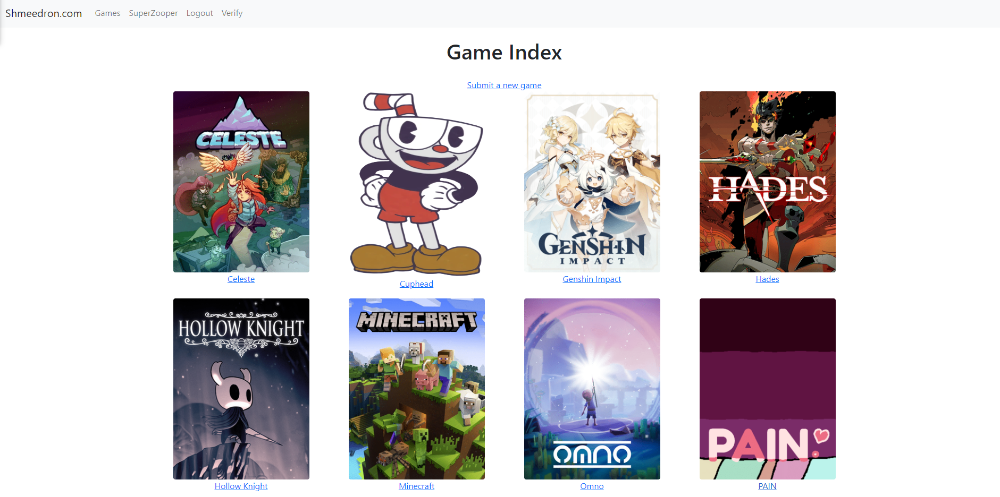
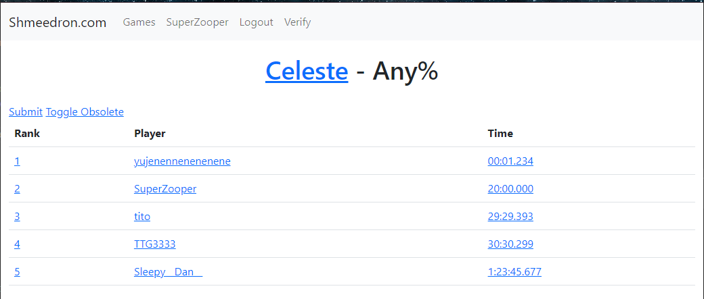
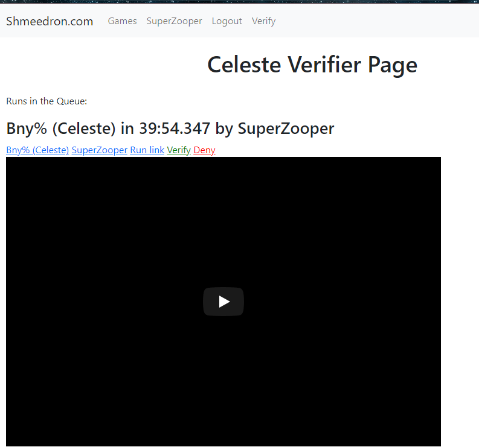
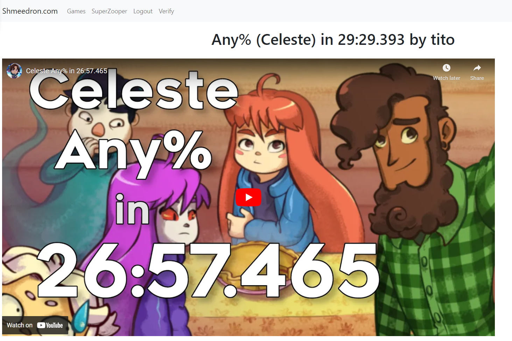
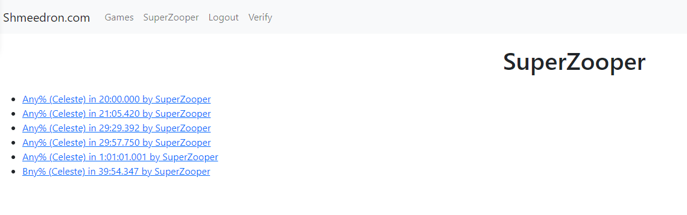

# ShmeedronTracker
A low effort first django project to make a speedrun.com like leaderboard website made in 2 days.

# Features:
- Main games page with ability to add new games
- Player profiles
- Run submitions with YouTube or Twitch links embeded, times and descriptions
- Leaderboards with the ability to see current and obsolete runs
- Category system with runs, rules etc...
- Verification pages to moderate runs on leaderboards
- Verifier permition system

# Screenshots:

# Running Dev Server (note for futre me, not for production)
1. Active the virtual environment with Django installed
2. Cd to the `shmeedron` directory
3. Start the devserver with `python manage.py runserver`